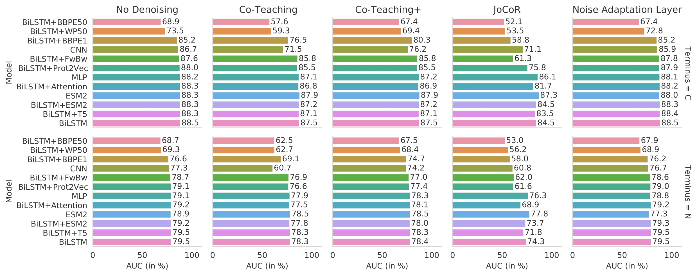
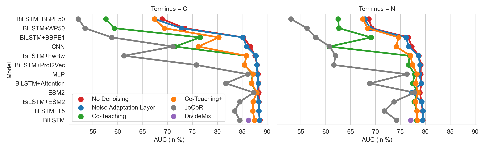

# Cleavage Prediction

This repository contains the code for the paper "What cleaves? Is proteasomal cleavage prediction reaching a ceiling?", accepted at NeurIPS'22 Learning Meaningful Representations of Life.

## Abstract
>Epitope vaccines are a promising direction to enable precision treatment for cancer, autoimmune diseases, and allergies. Effectively designing such vaccines requires accurate prediction of proteasomal cleavage in order to ensure that the epitopes in the vaccine are presented to T cells by the major histocompatibility complex (MHC). While direct identification of proteasomal cleavage **in vitro** is cumbersome and low throughput, it is possible to implicitly infer cleavage events from the termini of MHC-presented epitopes, which can be detected in large amounts thanks to recent advances in high-throughput MHC ligandomics. Inferring cleavage events in such a way provides an inherently noisy signal which can be tackled with new developments in the field of deep learning that supposedly make it possible to learn predictors from noisy labels. Inspired by such innovations, we sought to modernize proteasomal cleavage predictors by benchmarking a wide range of recent methods, including LSTMs, transformers, CNNs, and denoising methods, on a recently introduced cleavage dataset. We found that increasing model scale and complexity appeared to deliver limited performance gains, as several methods reached about 88.5\% AUC on C-terminal and 79.5\% AUC on N-terminal cleavage prediction. This suggests that the noise and/or complexity of proteasomal cleavage and the subsequent biological processes of the antigen processing pathway are the major limiting factors for predictive performance rather than the specific modeling approach used. While biological complexity can be tackled by more data and better models, noise and randomness inherently limit the maximum achievable predictive performance. All our datasets and experiments are available at [https://github.com/ziegler-ingo/cleavage_prediction](https://github.com/ziegler-ingo/cleavage_prediction). 

## Repository Structure
* `preprocessing` includes the notebooks that shuffle and split the data into C- and N-terminal, train, evaluation, and test split, as well as perform 3-mer and other basic preprocessing steps, such as tokenization
* `data` holds the `.csv` and `.tsv` train, evaluation, and test files, as well as a vocabulary file
* `denoise/divide_mix` holds our adjusted implementation of the DivideMix algorithm
    * try-out runs (e.g. testing impact of varying epochs, weight of unlabeled loss samples and distributions after Gaussian Mixture Model separation) can be found under `denoise/dividemix_tryout_debug`
    * all other tested denoising methods are directly impelemented in the notebooks
* `models/hyperparam_search` holds the training and hyperparameter search implementation of the asynchronous hyperband algorithm using Ray Tune 
* `models/final` holds the final training and evaluation structure for model architectures paired with all denoising approaches

### Naming structure of final notebooks
* All notebooks are named as follows: the applicable terminal, i.e. `c` or `n`, followed by the model architecture, e.g. `bilstm`, followed by the denoising method, e.g. `dividemix`
* Example: `c_bilstm_dividemix.ipynb`

#### Available model architectures
* BiLSTM, called `bilstm`
* BiLSTM with Attention, called `bilstm_att`
* BiLSTM with pre-trained Prot2Vec embeddings, called `bilstm_prot2vec`
* Attention enhanced CNN, called `cnn`
* BiLSTM with ESM2 representations as embeddings, called `bilstm_esm2`
* Fine-tuning of ESM2, called `esm2`
* BiLSTM with T5 representations as embeddings, called `bilstm_t5`
* Base BiLSTM with various trained tokenizers
    * Byte-level byte-pair encoder with vocabulary size 1000 and 50000, called `bilstm_bppe1` and `bilstm_bbpe50`
    * WordPair tokenizer with vocabulary size 50000, called `bilstm_wp50`
* BiLSTM with forward-backward representations as embeddings, called `bilstm_fwbw`

#### Available denoising architectures
* Co-Teaching, called `coteaching`
* Co-Teaching+, called `coteaching_plus`
* JoCoR, called `jocor`
* Noise Adaptation Layer, called `nad`
* DivideMix, called `dividemix`

## Achieved performances

## Sources for model architectures and denoising approaches
#### LSTM Architecture
* BiLSTM model architecture based on [Ozols et. al., 2021](https://www.mdpi.com/1422-0067/22/6/3071/htm)

#### LSTM Attention Architecture
* Model architecture based on [Liu and Gong, 2019](https://bmcbioinformatics.biomedcentral.com/counter/pdf/10.1186/s12859-019-3199-1.pdf), [Github](https://github.com/Jiale-Liu/LSTM)

#### CNN Architecture
* Model architecture based on [Li et al., 2020](https://academic.oup.com/bioinformatics/article/36/4/1057/5578482?login=true), Repository available via download section on [Homepage](https://deepcleave.erc.monash.edu/)

#### Prot2Vec Embeddings
* Prot2Vec embeddings based on [Asgari and Mofrad, 2015](https://journals.plos.org/plosone/article?id=10.1371/journal.pone.0141287), available on [Github](https://github.com/ehsanasgari/Deep-Proteomics)

#### FwBw Architecture
* Sequence Encoder model architecture based on [Heigold et al., 2016](https://arxiv.org/abs/1606.06640)

#### MLP Architecture
* Model architecture based on [DeepCalpain, Liu et al., 2019](https://www.frontiersin.org/articles/10.3389/fgene.2019.00715/full) and [Terminitor, Yang et al., 2020](https://www.biorxiv.org/content/10.1101/710699v2)

#### T5 Architecture
* T5 Encoder taken from [Elnagger et al., 2020](https://ieeexplore.ieee.org/document/9477085), [Github](https://github.com/agemagician/ProtTrans), Model on [Huggingface Hub](https://huggingface.co/Rostlab/prot_t5_xl_half_uniref50-enc)

#### ESM2 Architecture
* ESM2 taken from [Lin et al., 2022](https://www.biorxiv.org/content/10.1101/2022.07.20.500902v1), [Github](https://github.com/facebookresearch/esm)

#### Noise Adaptation Layer
* Noise adaptation layer implementation is based on [Goldberger and Ben-Reuven, 2017](https://openreview.net/references/pdf?id=Sk5qglwSl), and unofficial implementation on [Github](https://github.com/Billy1900/Noise-Adaption-Layer)

#### Co-teaching
* Co-teaching loss function and training process adaptations are based on [Han et al., 2018](https://arxiv.org/abs/1804.06872), and official implementation on [Github](https://github.com/bhanML/Co-teaching)

#### Co-teaching+
* Co-teaching+ loss function and training process adaptations are based on [Yu et al., 2019](https://arxiv.org/abs/1901.04215), and official implementation on [Github](https://github.com/xingruiyu/coteaching_plus)

#### JoCoR
* JoCoR loss function and training process adaptations are based on [Wei et al., 2020](https://openaccess.thecvf.com/content_CVPR_2020/html/Wei_Combating_Noisy_Labels_by_Agreement_A_Joint_Training_Method_with_CVPR_2020_paper.html), and official implementation on [Github](https://github.com/hongxin001/JoCoR)

#### DivideMix
* DivideMix structure is based on [Li et al., 2020](https://openreview.net/pdf?id=HJgExaVtwr), [Github](https://github.com/LiJunnan1992/DivideMix)
* As DivideMix was originally implemented for image data, we adjusted the MixMatch and Mixup part for sequential data, based on [Guo et al., 2019](https://arxiv.org/abs/1905.08941)
    * This part is directly implemented in the respective forward pass in the notebooks, and thus cannot be found in the DivideMix section
